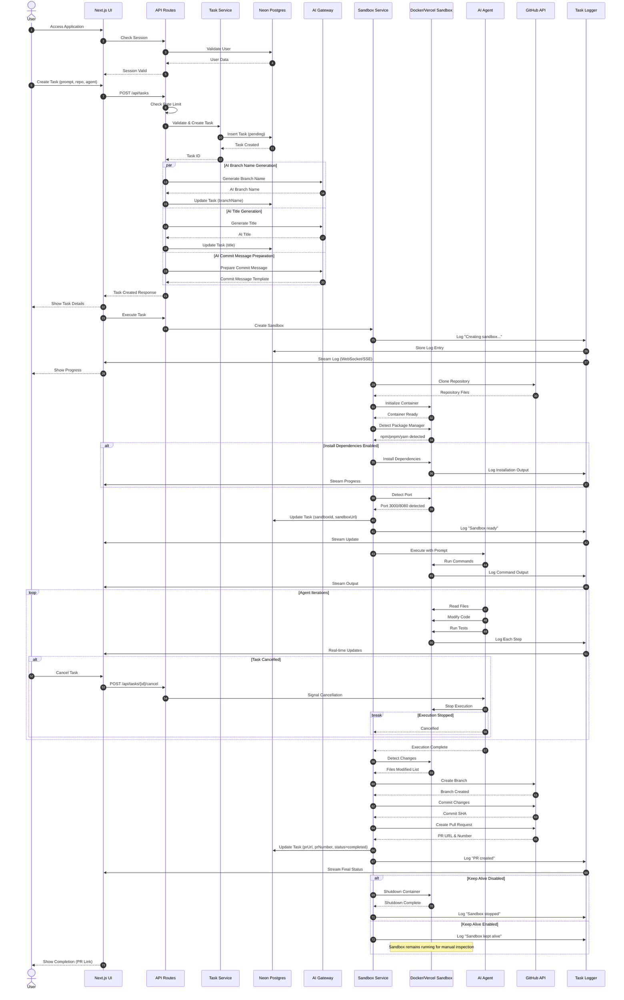
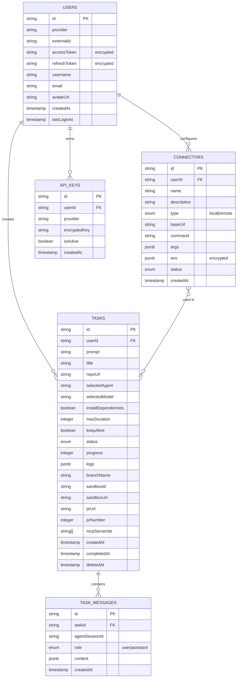
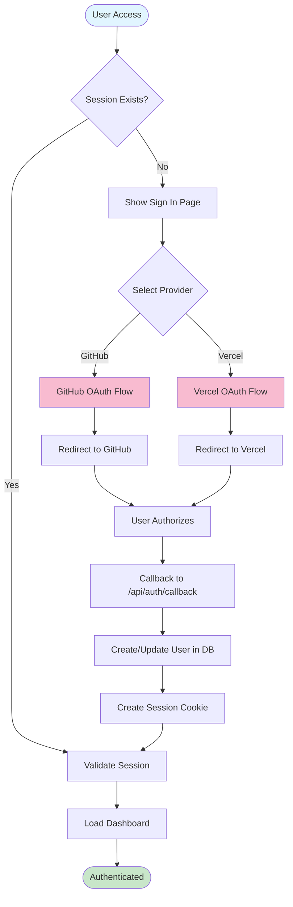
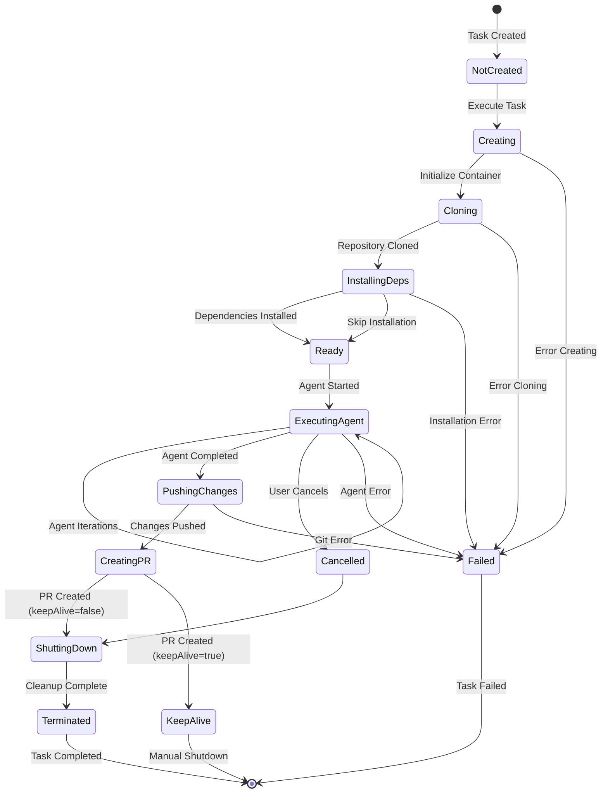
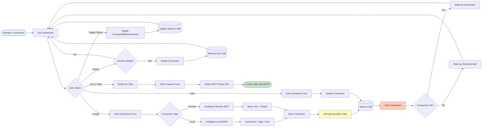
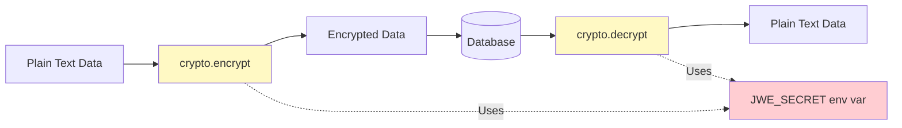
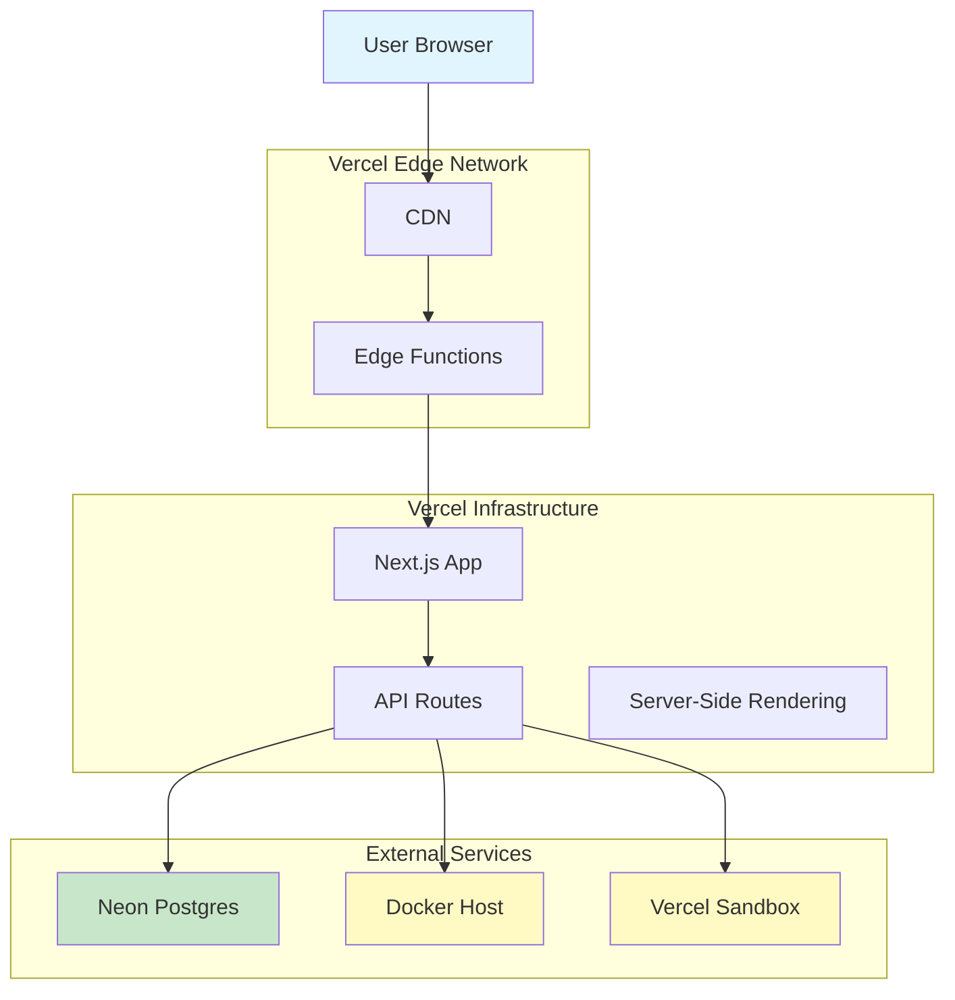

# Arquitetura 360º - Coding Agent Template

## Visão Geral do Sistema

Este documento apresenta uma visão completa da arquitetura, workflows e tasks do sistema Coding Agent Template - uma plataforma que permite a execução de agentes de IA (Claude, Codex, Copilot, Cursor, Gemini, OpenCode, Qwen, DeepSeek) em sandboxes isolados para automação de tarefas de desenvolvimento.

---

## Diagrama Arquitetural Completo

```mermaid
graph TB
    subgraph "Client Layer"
        UI[Next.js UI Layer]
        BROWSER[Browser/User]
    end

    subgraph "Authentication & Session"
        AUTH[OAuth Authentication]
        SESSION[Session Management]
        GITHUB_AUTH[GitHub OAuth]
        VERCEL_AUTH[Vercel OAuth]
    end

    subgraph "API Layer"
        API_TASKS["API: /api/tasks"]
        API_REPOS["API: /api/repos"]
        API_GITHUB["API: /api/github"]
        API_SANDBOX["API: /api/sandboxes"]
        API_CONNECTORS["API: /api/connectors"]
        API_KEYS["API: /api/api-keys"]
    end

    subgraph "Business Logic Layer"
        TASK_CREATION[Task Creation Service]
        SANDBOX_CREATION[Sandbox Creation Service]
        AGENT_EXEC[Agent Execution Service]
        GIT_OPS[Git Operations Service]
        LOGGER[Task Logger Service]
    end

    subgraph "AI Agents"
        CLAUDE[Claude Agent]
        CODEX[OpenAI Codex]
        COPILOT[GitHub Copilot]
        CURSOR[Cursor Agent]
        GEMINI[Google Gemini]
        OPENCODE[OpenCode]
        QWEN[Qwen Agent]
        DEEPSEEK[DeepSeek Agent]
    end

    subgraph "Sandbox Environment"
        DOCKER[Docker Sandbox]
        VERCEL_SANDBOX[Vercel Sandbox]
        SANDBOX_REGISTRY[Sandbox Registry]
        COMMANDS[Command Execution]
        PKG_MGR[Package Manager Detection]
        PORT_DETECT[Port Detection]
    end

    subgraph "External Services"
        GITHUB_API[GitHub API]
        VERCEL_API[Vercel API]
        MCP_SERVERS[MCP Servers]
        AI_GATEWAY[AI Gateway]
    end

    subgraph "Data Layer"
        NEON_DB[(Neon Postgres)]
        USERS_TABLE[(Users Table)]
        TASKS_TABLE[(Tasks Table)]
        CONNECTORS_TABLE[(Connectors Table)]
        MESSAGES_TABLE[(Task Messages)]
        API_KEYS_TABLE[(API Keys)]
    end

    subgraph "State Management"
        JOTAI[Jotai Atoms]
        LOCAL_STATE[Local Component State]
    end

    %% User Flow
    BROWSER -->|Authenticate| AUTH
    AUTH --> GITHUB_AUTH
    AUTH --> VERCEL_AUTH
    GITHUB_AUTH --> SESSION
    VERCEL_AUTH --> SESSION
    SESSION --> UI

    %% Task Creation Flow
    UI -->|Create Task| API_TASKS
    API_TASKS -->|Validate & Store| TASK_CREATION
    TASK_CREATION -->|Save Task| TASKS_TABLE
    TASK_CREATION -->|Generate Branch Name| AI_GATEWAY
    TASK_CREATION -->|Generate Title| AI_GATEWAY
    TASK_CREATION -->|Trigger Sandbox| SANDBOX_CREATION

    %% Sandbox Creation Flow
    SANDBOX_CREATION -->|Choose Provider| DOCKER
    SANDBOX_CREATION -->|Choose Provider| VERCEL_SANDBOX
    SANDBOX_CREATION -->|Clone Repo| GITHUB_API
    SANDBOX_CREATION -->|Detect Package Manager| PKG_MGR
    SANDBOX_CREATION -->|Install Dependencies| COMMANDS
    SANDBOX_CREATION -->|Detect Port| PORT_DETECT
    SANDBOX_CREATION -->|Register| SANDBOX_REGISTRY
    SANDBOX_CREATION -->|Log Progress| LOGGER

    %% Agent Execution Flow
    SANDBOX_CREATION -->|Execute Agent| AGENT_EXEC
    AGENT_EXEC -->|Route to Agent| CLAUDE
    AGENT_EXEC -->|Route to Agent| CODEX
    AGENT_EXEC -->|Route to Agent| COPILOT
    AGENT_EXEC -->|Route to Agent| CURSOR
    AGENT_EXEC -->|Route to Agent| GEMINI
    AGENT_EXEC -->|Route to Agent| OPENCODE
    AGENT_EXEC -->|Route to Agent| QWEN
    AGENT_EXEC -->|Route to Agent| DEEPSEEK
    
    CLAUDE -->|Use MCP Servers| MCP_SERVERS
    AGENT_EXEC -->|Execute in Sandbox| COMMANDS
    AGENT_EXEC -->|Log Output| LOGGER

    %% Git Operations Flow
    AGENT_EXEC -->|Push Changes| GIT_OPS
    GIT_OPS -->|Create Branch| GITHUB_API
    GIT_OPS -->|Commit Changes| GITHUB_API
    GIT_OPS -->|Create PR| GITHUB_API
    GIT_OPS -->|Update Task| TASKS_TABLE

    %% Logger Flow
    LOGGER -->|Stream Logs| TASKS_TABLE
    LOGGER -->|Real-time Updates| UI

    %% Repository Browser Flow
    UI -->|Browse Repos| API_REPOS
    API_REPOS -->|Fetch Data| GITHUB_API
    API_REPOS -->|Commits/Issues/PRs| UI

    %% Connectors Flow
    UI -->|Manage Connectors| API_CONNECTORS
    API_CONNECTORS -->|Store Config| CONNECTORS_TABLE
    API_CONNECTORS -->|Use in Tasks| MCP_SERVERS

    %% API Keys Flow
    UI -->|Manage Keys| API_KEYS
    API_KEYS -->|Encrypt & Store| API_KEYS_TABLE
    API_KEYS -->|Use in Execution| AGENT_EXEC

    %% State Management
    UI <-->|Sync State| JOTAI
    JOTAI <-->|Subscribe| LOCAL_STATE

    %% Database Relations
    USERS_TABLE -->|1:N| TASKS_TABLE
    USERS_TABLE -->|1:N| CONNECTORS_TABLE
    USERS_TABLE -->|1:N| API_KEYS_TABLE
    TASKS_TABLE -->|1:N| MESSAGES_TABLE

    style BROWSER fill:#e1f5ff
    style UI fill:#bbdefb
    style NEON_DB fill:#c8e6c9
    style DOCKER fill:#fff9c4
    style VERCEL_SANDBOX fill:#fff9c4
    style CLAUDE fill:#ffccbc
    style GITHUB_API fill:#f8bbd0
```



---

## Workflow Detalhado: Ciclo de Vida de uma Task



---

## Estrutura de Dados e Relacionamentos



---

## Fluxos de Trabalho Principais

### 1. Autenticação e Onboarding



### 2. Criação e Execução de Task

```mermaid
flowchart TD
    START([User Creates Task]) --> FILL_FORM[Fill Task Form]
    FILL_FORM --> FORM_DATA{Form Fields}
    FORM_DATA --> PROMPT[Task Prompt]
    FORM_DATA --> REPO[Repository URL]
    FORM_DATA --> AGENT[Select Agent]
    FORM_DATA --> OPTIONS[Options]
    
    OPTIONS --> INSTALL_DEPS[Install Dependencies?]
    OPTIONS --> MAX_DURATION[Max Duration]
    OPTIONS --> KEEP_ALIVE[Keep Alive?]
    OPTIONS --> MCP[MCP Servers]
    
    PROMPT --> VALIDATE[Validate Form]
    REPO --> VALIDATE
    AGENT --> VALIDATE
    
    VALIDATE -->|Invalid| SHOW_ERROR[Show Validation Error]
    SHOW_ERROR --> FILL_FORM
    
    VALIDATE -->|Valid| RATE_LIMIT{Check Rate Limit}
    RATE_LIMIT -->|Exceeded| SHOW_LIMIT[Show Rate Limit Error]
    SHOW_LIMIT --> END_ERROR([Task Not Created])
    
    RATE_LIMIT -->|OK| CREATE_TASK[POST /api/tasks]
    CREATE_TASK --> INSERT_DB[Insert Task in DB]
    INSERT_DB --> TASK_ID[Generate Task ID]
    TASK_ID --> ASYNC_AI[Background: AI Generation]
    
    ASYNC_AI --> GEN_BRANCH[Generate Branch Name]
    ASYNC_AI --> GEN_TITLE[Generate Task Title]
    ASYNC_AI --> GEN_COMMIT[Prepare Commit Message]
    
    GEN_BRANCH --> UPDATE_DB[Update Task in DB]
    GEN_TITLE --> UPDATE_DB
    GEN_COMMIT --> UPDATE_DB
    
    TASK_ID --> REDIRECT[Redirect to /tasks/[taskId]]
    REDIRECT --> SHOW_TASK[Show Task Details]
    
    SHOW_TASK --> USER_ACTION{User Action}
    USER_ACTION -->|Execute| START_SANDBOX[Create Sandbox]
    USER_ACTION -->|Wait| SHOW_TASK
    
    START_SANDBOX --> CLONE_REPO[Clone Repository]
    CLONE_REPO --> DETECT_PKG[Detect Package Manager]
    DETECT_PKG --> INSTALL[Install Dependencies?]
    
    INSTALL -->|Yes| RUN_INSTALL[Run npm/pnpm install]
    INSTALL -->|No| SKIP_INSTALL[Skip Installation]
    
    RUN_INSTALL --> DETECT_PORT[Detect Port]
    SKIP_INSTALL --> DETECT_PORT
    
    DETECT_PORT --> SANDBOX_READY[Sandbox Ready]
    SANDBOX_READY --> EXEC_AGENT[Execute AI Agent]
    
    EXEC_AGENT --> AGENT_LOOP[Agent Iterates]
    AGENT_LOOP --> READ_FILES[Read Source Files]
    READ_FILES --> MODIFY[Modify Code]
    MODIFY --> TEST[Run Tests/Commands]
    TEST --> CHECK_DONE{Agent Done?}
    
    CHECK_DONE -->|No| AGENT_LOOP
    CHECK_DONE -->|Yes| GIT_OPS[Git Operations]
    
    GIT_OPS --> CREATE_BRANCH[Create Branch]
    CREATE_BRANCH --> COMMIT[Commit Changes]
    COMMIT --> PUSH[Push to GitHub]
    PUSH --> CREATE_PR[Create Pull Request]
    CREATE_PR --> UPDATE_TASK[Update Task Status]
    UPDATE_TASK --> CLEANUP{Keep Alive?}
    
    CLEANUP -->|No| SHUTDOWN[Shutdown Sandbox]
    CLEANUP -->|Yes| KEEP[Keep Sandbox Running]
    
    SHUTDOWN --> COMPLETE[Mark Task Completed]
    KEEP --> COMPLETE
    COMPLETE --> END([Task Finished])

    style START fill:#e1f5ff
    style END fill:#c8e6c9
    style END_ERROR fill:#ffcdd2
    style EXEC_AGENT fill:#ffccbc
    style CREATE_PR fill:#f8bbd0
```

### 3. Gerenciamento de Sandbox



### 4. Gerenciamento de Conectores (MCP Servers)



---

## Componentes Principais e Responsabilidades

### Frontend Components

| Componente | Responsabilidade | Localização |
|-----------|------------------|-------------|
| `task-form.tsx` | Formulário de criação de tasks | `/components` |
| `task-details.tsx` | Exibição de detalhes da task | `/components` |
| `task-chat.tsx` | Interface de chat com agente | `/components` |
| `logs-pane.tsx` | Painel de logs em tempo real | `/components` |
| `terminal.tsx` | Terminal embutido para sandbox | `/components` |
| `file-browser.tsx` | Navegador de arquivos do sandbox | `/components` |
| `file-editor.tsx` | Editor de código integrado | `/components` |
| `repo-layout.tsx` | Layout para navegação de repositórios | `/components` |
| `repo-commits.tsx` | Lista de commits | `/components` |
| `repo-issues.tsx` | Lista de issues | `/components` |
| `repo-pull-requests.tsx` | Lista de pull requests | `/components` |
| `manage-connectors.tsx` | Gerenciamento de MCP servers | `/components/connectors` |
| `api-keys-dialog.tsx` | Gerenciamento de API keys | `/components` |

### Backend Services

| Service | Responsabilidade | Localização |
|---------|------------------|-------------|
| Task Service | CRUD de tasks, validação | `/app/api/tasks/route.ts` |
| Sandbox Creation | Criação e configuração de sandboxes | `/lib/sandbox/creation.ts` |
| Agent Execution | Roteamento e execução de agentes | `/lib/sandbox/agents/index.ts` |
| Git Operations | Operações Git (branch, commit, PR) | `/lib/sandbox/git.ts` |
| Task Logger | Sistema de logging estruturado | `/lib/utils/task-logger.ts` |
| Sandbox Registry | Registro e recuperação de sandboxes | `/lib/sandbox/sandbox-registry.ts` |
| GitHub Client | Integração com API do GitHub | `/lib/github/client.ts` |
| Vercel Client | Integração com Vercel Sandbox | `/lib/vercel-client/index.ts` |
| Session Management | Autenticação e sessões | `/lib/session/` |
| Crypto Service | Criptografia de dados sensíveis | `/lib/crypto.ts` |

### Agentes Disponíveis

| Agente | Arquivo | Características |
|--------|---------|-----------------|
| Claude | `/lib/sandbox/agents/claude.ts` | Suporta MCP Servers, resumo de sessão |
| OpenAI Codex | `/lib/sandbox/agents/codex.ts` | CLI `openai-code` |
| GitHub Copilot | `/lib/sandbox/agents/copilot.ts` | CLI `gh copilot`, parser customizado |
| Cursor | `/lib/sandbox/agents/cursor.ts` | CLI `cursor`, parser customizado |
| Gemini | `/lib/sandbox/agents/gemini.ts` | Google Gemini CLI |
| OpenCode | `/lib/sandbox/agents/opencode.ts` | CLI genérico |
| Qwen | `/lib/sandbox/agents/qwen.ts` | Qwen agent |
| DeepSeek | `/lib/sandbox/agents/deepseek.ts` | DeepSeek agent |

---

## Integrações Externas

### GitHub API

**Endpoints Utilizados:**
- `GET /user` - Obter dados do usuário autenticado
- `GET /repos/:owner/:repo` - Obter detalhes do repositório
- `GET /repos/:owner/:repo/commits` - Listar commits
- `GET /repos/:owner/:repo/issues` - Listar issues
- `GET /repos/:owner/:repo/pulls` - Listar pull requests
- `POST /repos/:owner/:repo/git/refs` - Criar branch
- `POST /repos/:owner/:repo/pulls` - Criar pull request
- `GET /repos/:owner/:repo/pulls/:number` - Obter status do PR
- `PATCH /repos/:owner/:repo/pulls/:number` - Atualizar PR

**Autenticação:**
- OAuth via Arctic library
- Personal Access Token (PAT) armazenado criptografado

### Vercel API

**Endpoints Utilizados:**
- `GET /v2/teams` - Listar times
- `POST /v13/deployments` - Criar deployment
- Vercel Sandbox SDK para execução de código

**Autenticação:**
- OAuth via Vercel SDK
- Token armazenado criptografado

### AI Gateway

**Funcionalidades:**
- Geração de nomes de branches semanticamente relevantes
- Geração de títulos de tasks
- Geração de mensagens de commit descritivas

**Configuração:**
- `AI_GATEWAY_API_KEY` obrigatória
- Fallback para nomes baseados em timestamp se indisponível

### MCP Servers (Model Context Protocol)

**Suporte:**
- Apenas para Claude agent
- Conectores locais (via comando CLI)
- Conectores remotos (via HTTP + OAuth)

**Configuração:**
- Armazenamento seguro de credenciais
- Variáveis de ambiente criptografadas
- Status de conexão rastreado

---

## Segurança e Compliance

### Criptografia de Dados Sensíveis



**Dados Criptografados:**
- OAuth access tokens (GitHub, Vercel)
- OAuth refresh tokens
- API keys do usuário (Anthropic, OpenAI, Gemini, Cursor)
- Variáveis de ambiente de conectores MCP
- OAuth client secrets

### Logging Seguro

**Regras Críticas (AGENTS.md):**
1. ✅ **NUNCA incluir valores dinâmicos em logs**
2. ✅ **Usar apenas strings estáticas**
3. ✅ **Aplicável a TODOS os níveis de log**
4. ✅ **Redação automática de credenciais via `redactSensitiveInfo()`**

**Padrões de Redação:**
- API keys (ANTHROPIC_API_KEY, OPENAI_API_KEY, etc.)
- GitHub tokens (ghp_, gho_, ghu_, ghs_, ghr_)
- Vercel credentials (SANDBOX_VERCEL_TOKEN, TEAM_ID, PROJECT_ID)
- Bearer tokens
- Variáveis de ambiente sensíveis

### Rate Limiting

**Implementação:**
- Limite diário de mensagens por usuário
- Rastreamento de tasks + follow-ups
- Resetar à meia-noite
- Resposta 429 quando limite excedido

**Armazenamento:**
- Tabela `user_settings` no banco de dados
- Campo `dailyMessageLimit` configurável
- Campo `lastMessageReset` para tracking

---

## Estado e Sincronização

### Jotai Atoms (State Management)

```mermaid
flowchart TD
    subgraph "Global State (Jotai)"
        SESSION_ATOM[sessionAtom]
        TASKS_ATOM[tasksAtom]
        CONNECTORS_ATOM[connectorsAtom]
        API_KEYS_ATOM[apiKeysAtom]
        THEME_ATOM[themeAtom]
    end
    
    subgraph "React Components"
        TASK_LIST[TasksList]
        TASK_DETAILS[TaskDetails]
        CONNECTOR_MANAGER[ManageConnectors]
        API_KEYS_DIALOG[ApiKeysDialog]
    end
    
    subgraph "API Layer"
        API_TASKS[/api/tasks]
        API_CONNECTORS[/api/connectors]
        API_KEYS[/api/api-keys]
    end
    
    SESSION_ATOM <--> TASK_LIST
    TASKS_ATOM <--> TASK_LIST
    TASKS_ATOM <--> TASK_DETAILS
    CONNECTORS_ATOM <--> CONNECTOR_MANAGER
    API_KEYS_ATOM <--> API_KEYS_DIALOG
    
    TASK_LIST <--> API_TASKS
    TASK_DETAILS <--> API_TASKS
    CONNECTOR_MANAGER <--> API_CONNECTORS
    API_KEYS_DIALOG <--> API_KEYS

    style SESSION_ATOM fill:#e1f5ff
    style TASKS_ATOM fill:#bbdefb
    style CONNECTORS_ATOM fill:#c5cae9
    style API_KEYS_ATOM fill:#f8bbd0
```

### Real-time Updates

**Implementação:**
- Polling a cada 5 segundos para status de tasks
- Streaming de logs via API route
- WebSocket futuro (planejado)

**Endpoints de Sincronização:**
- `GET /api/tasks` - Lista todas as tasks do usuário
- `GET /api/tasks/[taskId]` - Detalhes de uma task específica
- `GET /api/tasks/[taskId]/logs` - Logs em tempo real
- `POST /api/tasks/[taskId]/sync-pr` - Sincronizar status do PR

---

## Performance e Otimizações

### Sandbox Lifecycle

```mermaid
gantt
    title Ciclo de Vida do Sandbox
    dateFormat X
    axisFormat %Ss

    section Criação
    Initialize Container    :0, 5s
    Clone Repository       :5s, 15s
    Install Dependencies   :20s, 40s
    
    section Execução
    Agent Setup           :60s, 10s
    Agent Iteration 1     :70s, 30s
    Agent Iteration 2     :100s, 30s
    Agent Iteration 3     :130s, 30s
    
    section Conclusão
    Git Operations        :160s, 20s
    Create PR            :180s, 10s
    Cleanup              :190s, 10s
```

**Otimizações:**
1. **Detecção de Package Manager** - Usa cache de detecções anteriores
2. **Instalação Condicional** - Permite pular instalação de dependências
3. **Detecção de Porta** - Lê arquivos de configuração antes de rodar servidor
4. **Keep Alive** - Mantém sandbox ativo para debugging
5. **Sandbox Registry** - Reutiliza sandboxes existentes quando possível

### Database Queries

**Indexes Definidos:**
- `users_provider_external_id_idx` - Unique constraint para prevenir duplicatas
- Foreign keys com cascade delete para limpeza automática

**Soft Delete:**
- Tasks: campo `deletedAt` permite recuperação
- Queries excluem automaticamente tasks deletadas via `isNull(tasks.deletedAt)`

---

## Testes e Qualidade

### Test Coverage

**Arquivos de Teste:**
- `/lib/utils/task-logger.test.ts` - Task logger
- `/components/task-form.test.tsx` - Task form
- `/lib/sandbox/docker-sandbox.test.ts` - Docker sandbox
- `/lib/sandbox/agents/copilot-parser.test.ts` - Copilot parser
- `/lib/sandbox/agents/cursor-parser.test.ts` - Cursor parser
- `/app/api/vercel/teams/route.test.ts` - Vercel teams API

**Scripts:**
- `pnpm test` - Executar testes
- `pnpm test:coverage` - Coverage report
- `pnpm type-check` - TypeScript type checking
- `pnpm lint` - ESLint
- `pnpm format` - Prettier formatting

### Quality Checks

**CI/CD Pipeline (presumido):**
1. Type checking
2. Linting
3. Unit tests
4. Integration tests
5. Build verification

---

## Deployment e Infraestrutura

### Deployment Architecture



### Environment Variables

**Obrigatórias:**
- `DATABASE_URL` - Neon Postgres connection string
- `JWE_SECRET` - Secret para criptografia JWE
- `ENCRYPTION_KEY` - Key para criptografia de dados sensíveis
- `GITHUB_CLIENT_ID` + `GITHUB_CLIENT_SECRET` - GitHub OAuth
- `VERCEL_CLIENT_ID` + `VERCEL_CLIENT_SECRET` - Vercel OAuth

**Opcionais:**
- `AI_GATEWAY_API_KEY` - Para geração de nomes/títulos via IA
- `SANDBOX_VERCEL_TOKEN` - Para Vercel Sandbox
- `MAX_SANDBOX_DURATION` - Timeout padrão (segundos)
- `ANTHROPIC_API_KEY` - Claude agent (fallback se usuário não configurar)
- `OPENAI_API_KEY` - Codex agent (fallback)

---

## Roadmap e Melhorias Futuras

### Features Planejadas

1. **WebSocket para Logs** - Substituir polling por WebSocket real-time
2. **Multi-Repository Tasks** - Suporte para tasks que afetam múltiplos repositórios
3. **Task Templates** - Templates pré-configurados para tarefas comuns
4. **Team Collaboration** - Compartilhamento de tasks entre usuários
5. **Advanced Analytics** - Métricas de uso, tempo de execução, taxa de sucesso
6. **Custom Docker Images** - Permitir usuários configurarem imagens customizadas
7. **Scheduled Tasks** - Executar tasks automaticamente em horários agendados
8. **Webhook Triggers** - Iniciar tasks via webhooks (GitHub push, issue criado, etc.)

### Melhorias Técnicas

1. **Caching Layer** - Redis para cache de dados frequentes
2. **Queue System** - Bull/BullMQ para processamento assíncrono
3. **Monitoring** - Integração com Sentry, DataDog ou similar
4. **E2E Tests** - Playwright/Cypress para testes end-to-end
5. **API Documentation** - OpenAPI/Swagger para documentação automática
6. **GraphQL Layer** - Alternativa para queries complexas
7. **Incremental Static Regeneration** - Para páginas de repositórios

---

## Conclusão

Este documento apresenta uma visão 360º da arquitetura do **Coding Agent Template**. O sistema é projetado para ser:

✅ **Modular** - Componentes independentes e reutilizáveis  
✅ **Escalável** - Suporta múltiplos agentes e usuários simultâneos  
✅ **Seguro** - Criptografia de dados sensíveis e logging seguro  
✅ **Extensível** - Fácil adicionar novos agentes ou conectores  
✅ **Observável** - Logs estruturados e rastreamento de execução  

**Stack Tecnológico Principal:**
- Next.js 16 + React 19
- Vercel Sandbox + Docker
- Neon Postgres + Drizzle ORM
- 8 Agentes de IA integrados
- GitHub + Vercel APIs
- OAuth Authentication (Arctic)
- Jotai State Management
- Tailwind CSS + Radix UI

Para mais detalhes sobre componentes específicos, consulte o código-fonte nos diretórios correspondentes.

---

**Última Atualização:** 2025-01-26  
**Versão:** 1.0.0
